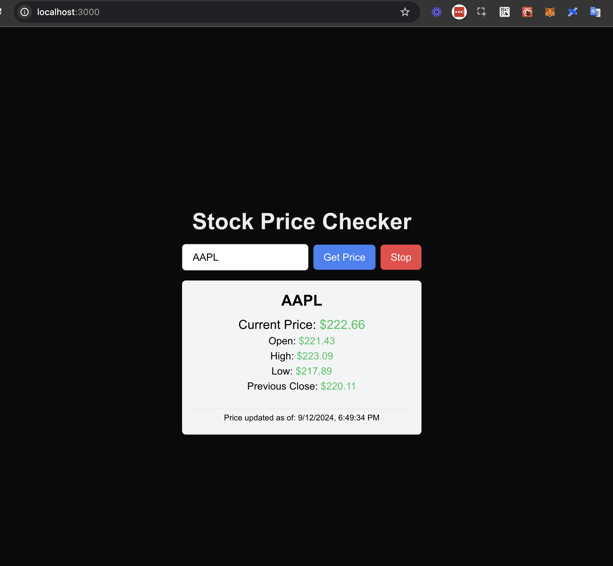
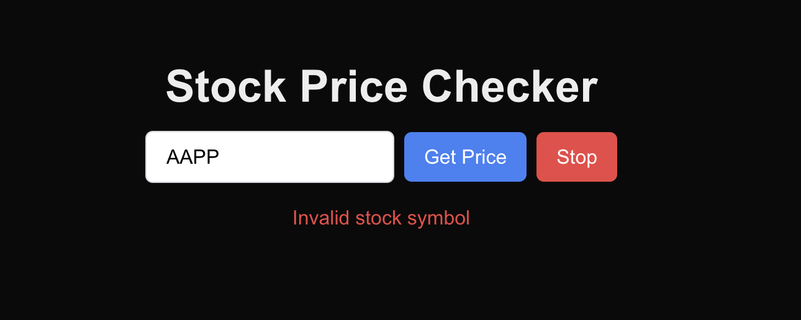

# Stock Price Checker

This is a Next.js application that allows users to check real-time stock prices using the Finnhub API.

## Features

- Search for stock prices by entering a stock symbol
- Real-time price updates every second
- Display of current price, open, high, low, and previous close
- Error handling for invalid stock symbols
- Start and stop polling functionality

## Getting Started

1. Clone the repository
2. Install dependencies:
   ```
   npm install
   ```
3. Create a `.env.local` file in the root directory and add your Finnhub API key:
   ```
   NEXT_PUBLIC_FINNHUB_API_KEY=your_api_key_here
   ```
4. Run the development server:
   ```
   npm run dev
   ```
5. Open [http://localhost:3000](http://localhost:3000) in your browser

## Screenshots




## Technologies Used

- Next.js
- React
- TypeScript
- Tailwind CSS
- Finnhub API

## Contributing

Pull requests are welcome. For major changes, please open an issue first to discuss what you would like to change.

## License

[MIT](https://choosealicense.com/licenses/mit/)
